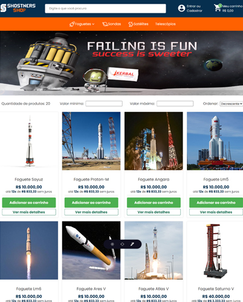

# Shostners Shop
Live preview: [clique aqui](https://Lcarrati.github.io/react-ecommerce)

E-commerce desenvolvido em React.js e styled-components para criar uma interface que prioriza a experiência do usuário com recursos como um carrinho dinâmico, navegação por categorias, filtros avançados e ordenação personalizada.
O foco na experiência do usuário é resultado da minha experiência como gestor de e-commerce. Cada recursofoi cuidadosamente projetado para atender às necessidades dos clientes, fornecendo informações claras e prontamente disponíveis para uma melhor experiência de compra.

## Recursos Destacados:

- **Carrinho Dinâmico:** O carrinho exibe em tempo real a quantidade e o valor dos itens adicionados, fornecendo aos usuários uma visão clara de suas escolhas.

- **Navegação por Categorias:** Os clientes podem explorar facilmente produtos específicos através da navegação intuitiva separada em categorias.

- **Filtros e Ordenação:** Recursos de filtragem e ordenação permitem aos usuários personalizar suas pesquisas, facilitando encontrar os produtos desejados.

- **React Hooks e Contexto Global:** Código eificente, organizado e escalável utilizando os vários hooks nativos do React e a React Context API.

## Objetivo:

Ao criar este E-commerce, meu objetivo era ir além da criação de uma simples plataforma de compras online. Eu busquei desenvolver uma experiência de usuário eficiente, demonstrando não apenas minhas habilidades técnicas em React.js, mas também minha capacidade de criar soluções web que atendam às necessidades do público-alvo.

### Demonstração
[Live preview](https://Lcarrati.github.io/react-ecommerce)

